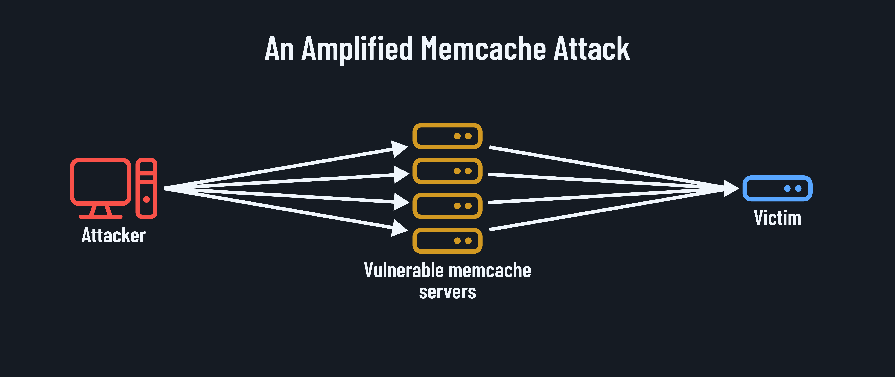
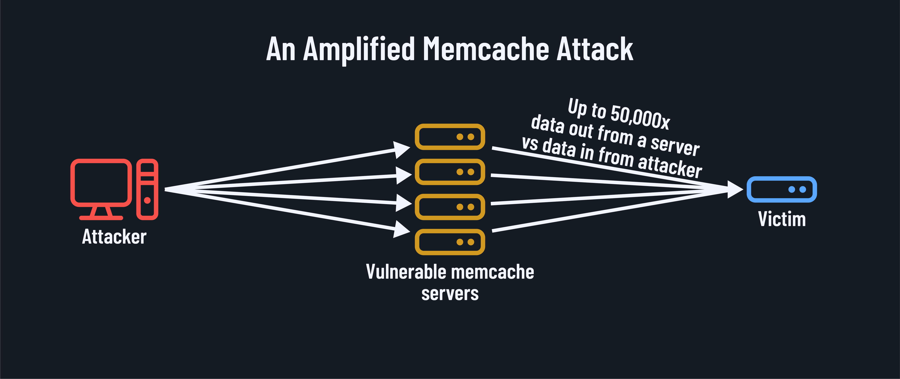

<h1>
  Network+ Case Study
  The GitHub DDoS Attack of 2018
</h1>

**Learning objective:** By the end of this lesson, students will be able to describe the factors contributing to a significant networking incident against the popular code hosting platform GitHub. This attack, which exploited vulnerabilities in the Memcached protocol, is a powerful reminder of the critical importance of network security fundamentals and the real-world value of the skills covered in the CompTIA Network+ certification.

## The story of the attack

On February 28, 2018, GitHub, a platform used by millions of developers to store, manage, and collaborate on code, [suffered a devastating DDoS attack](https://github.blog/news-insights/company-news/ddos-incident-report/). The attack flooded GitHub's servers with a staggering 1.35 terabits per second (Tbps) of traffic, making it one of the largest DDoS attacks ever recorded at the time.

The attack exploited a vulnerability in the *Memcached protocol*, which is designed to cache data and reduce strain on heavier data stores like databases. By sending spoofed requests to exposed Memcached servers, the attackers were able to amplify their attack, turning a relatively small number of requests into an overwhelming flood of traffic.

Despite the scale of the attack, GitHub managed to restore services within a matter of minutes thanks to their robust DDoS mitigation strategies and the swift actions of their network engineering team. However, the incident served as a stark reminder of the ever-present threat of DDoS attacks and the importance of fundamental network security skills.

## Analyzing the attack

To understand how the memcached DDoS attack worked and what network fundamentals could have prevented or mitigated it, let's break down the three key components:

1. **Memcached amplification**

   The attackers exploited a vulnerability in the Memcached protocol known as *amplification*. They sent spoofed requests to exposed Memcached servers, making it appear that the requests were coming from GitHub's IP address. The servers then responded with much larger packets of data (more than 50,000 time larger), amplifying the size of the attack.

   

   **Network+ concept - IP address spoofing**: IP address spoofing is a technique where an attacker falsifies the source IP address in a packet header to disguise their identity or to impersonate another device. Understanding how spoofing works and how to prevent it with techniques like ingress filtering is a crucial network security skill covered in the CompTIA Network+ curriculum.

2. **Exposed Memcached servers**

   For the amplification to work, the attackers needed to find Memcached servers exposed to the public internet. These servers, which should have been secured behind firewalls, allowed the attackers to send spoofed requests and generate amplified traffic.

   **Network+ concept - Firewall configuration**: Firewalls are critical to network security, controlling traffic between networks based on predefined security rules. Properly configuring firewalls to block unauthorized access to internal services like Memcached is an essential skill emphasized in the CompTIA Network+ certification.

3. **Volumetric DDoS attack**

   The amplified responses from the Memcached servers created a massive wave of traffic directed at GitHub's servers. This type of attack, known as a volumetric DDoS attack, aims to overwhelm the target's network bandwidth, making services unavailable to legitimate users.

   **Network+ concept - DDoS mitigation strategies**: Defending against DDoS attacks requires a multi-layered approach, including techniques like rate limiting, traffic filtering, and load balancing. The CompTIA Network+ curriculum covers these strategies, equipping learners with the skills to implement robust DDoS defenses.

By understanding these key components of the attack and their relation to fundamental network concepts, we can appreciate the real-world importance of the skills covered in the CompTIA Network+ certification.

## Lessons learned

The GitHub DDoS attack of 2018 offers several critical lessons for network professionals and highlights the practical value of the CompTIA Network+ curriculum:

### The importance of security fundamentals

The attack underscored the importance of getting the basics right regarding network security. Simple measures like properly configuring firewalls, securing exposed services, and implementing anti-spoofing techniques can go a long way in preventing or mitigating DDoS attacks.

**Network+ connection:** The CompTIA Network+ certification emphasizes the foundational skills required to secure networks, including firewall configuration, access control, and best practices for hardening network devices.

### The global nature of threats

The Memcached amplification attack relied on exploiting exposed servers across the globe, demonstrating how vulnerabilities in one part of the internet can be leveraged to attack targets anywhere in the world.

**Network+ connection:** The CompTIA Network+ curriculum covers the global nature of the internet and the importance of considering external threats when designing and securing networks.

### The value of collaboration

GitHub's swift response to the attack showcased the importance of collaboration between network teams, service providers, and the broader tech community. Sharing threat intelligence and best practices can help organizations avoid emerging threats.

**Network+ connection:** The CompTIA Network+ certification fosters a community of skilled professionals who can work together to combat network threats and share knowledge for the betterment of all.

By internalizing these lessons and developing the skills covered in the CompTIA Network+ curriculum, aspiring network professionals can prepare themselves to face the ever-evolving landscape of network threats.

## Looking ahead

The GitHub DDoS attack of 2018 may be history, but the threat of DDoS attacks is far from a thing of the past. As our world becomes increasingly interconnected and reliant on digital services, the potential impact of such attacks only grows.

However, we can build a more secure and resilient digital future by investing in the development of skilled network professionals armed with the knowledge and practical abilities covered in the CompTIA Network+ certification.

From understanding the basics of network operations to implementing advanced security strategies, the CompTIA Network+ curriculum provides a comprehensive foundation for success in the field of networking. By mastering these skills, aspiring professionals can respond to incidents like the GitHub attack and proactively work to prevent them.

So, let this case study serve as a reminder of the critical importance of fundamental network skills and a call to action for all those passionate about building a safer digital world. With the right knowledge, skills, and dedication, we can rise to the challenge of securing our networks against even the most daunting threats.
